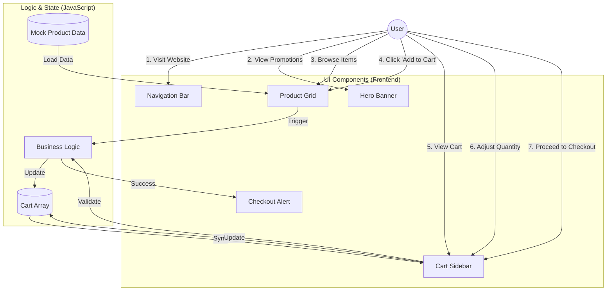
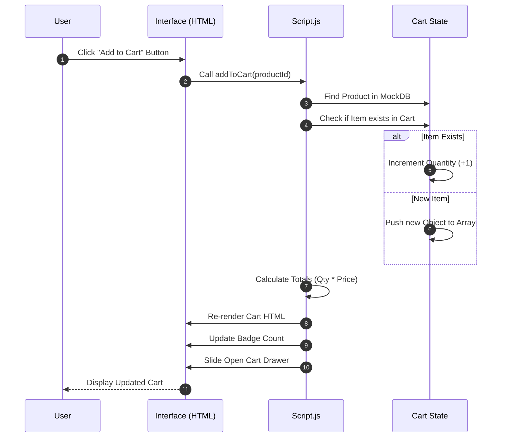
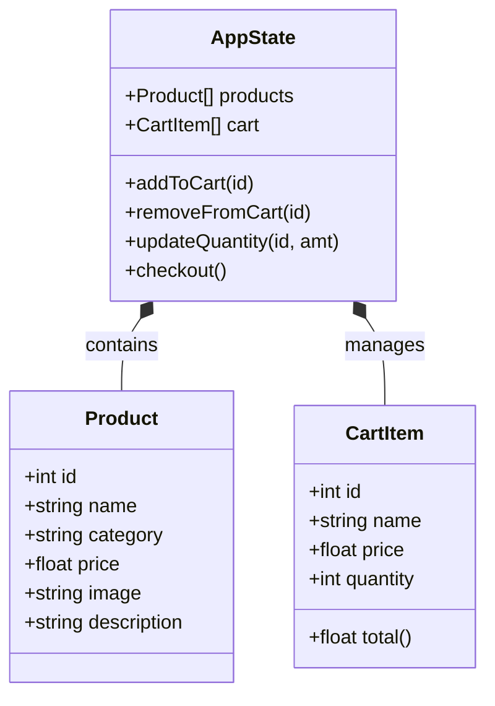

# Shopii Enterprise Architecture Diagrams

## 1. Application Structure (User Interaction Flow)
This diagram shows how the user interacts with the main components of the application and how data flows between them.

## 2. Add to Cart Logic (Sequence Diagram)
This details the specific steps that happen when a user adds an item to their cart.

## 3. Class/Data Structure
The shape of the data objects used in the application.

